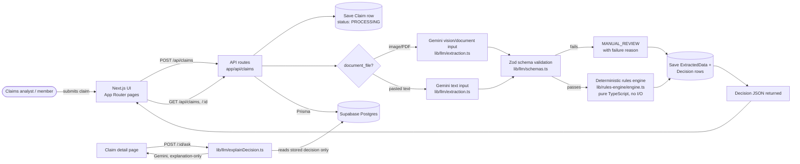

# Architecture

## System diagram



## Tech stack and why

| Layer | Choice | Why |
|---|---|---|
| Frontend + Backend | Next.js (App Router), TypeScript strict | One framework for both, shippable solo in a short window |
| Styling | Tailwind CSS v3, ported design tokens | Pixel-matches the `Design/` mockups; v3's JS config could be copied from the mockups verbatim (v4's CSS-first config would need manual re-translation) |
| Database | Supabase (Postgres) | Free tier, hosted, no infra to manage |
| ORM | Prisma v6 | Type-safe schema/migrations |
| LLM | Google Gemini (`@google/genai`) | Genuinely free tier (no card), multimodal (image/PDF), and — critically — a *cloud* API reachable from a deployed backend, unlike a local model. |
| Validation | Zod | Every LLM response and every API request body is schema-validated before touching the rules engine or the database |

## The one architectural rule everything else follows

**The rules engine (`lib/rules-engine/`) is a pure function with zero I/O** —
no database calls, no network calls, no LLM calls. It takes a `ClaimInput`
and a `MedicalNecessitySignal | undefined` and returns a `Decision`,
deterministically, every time. This is what makes it possible to unit-test
all 10 required scenarios (plus 19 supplementary ones covering codes/
categories/scenarios the 10 don't reach) in milliseconds with `npm test`,
with no API keys or database needed.

The LLM (`lib/llm/`) only ever produces two things, and neither is the
decision itself:
1. **Extracted facts** (`ExtractionResult.documents`) — fed into the engine
   as input, same shape whether it came from pasted text or a photographed
   document.
2. **Advisory signals** — the medical-necessity opinion (adjusts confidence,
   never rejects) and the "Ask about this decision" explanations (read
   the already-final decision, never write to it).

**The policy itself is admin-editable (bonus feature) without breaking this
rule.** `adjudicate()` takes `policy` as an optional parameter — every
existing test omits it and gets the static `POLICY` default unchanged;
`lib/api/processClaim.ts` (the real runtime path) fetches the current
value from the database via `lib/db/policyConfig.ts` and passes it in
explicitly. The engine function itself still does zero I/O — the fetching
happens one layer up, outside `lib/rules-engine/` entirely.

## Folder structure

```
/app
  /api/auth/login         → POST (demo session, public)
  /api/auth/logout         → POST (clears both the demo AND admin session cookies)
  /api/claims            → POST (submit), GET (list)
  /api/claims/[id]        → GET (detail, incl. appeal if one exists)
  /api/claims/[id]/ask     → POST (AI explanation, bonus feature)
  /api/claims/[id]/appeal  → POST (submit an appeal, bonus feature)
  /api/admin/login          → POST (separate admin credential, on top of the demo session)
  /api/admin/logout          → POST (drops only the admin credential, back to the demo session)
  /api/admin/appeals          → GET (list, admin-only)
  /api/admin/appeals/[id]/resolve → POST (uphold/overturn, admin-only)
  /api/admin/policy             → GET/PUT (admin-editable policy config)
  /claims                → dashboard (stats, decision breakdown, AI accuracy
                            metrics, recent claims)
  /claims/new              → submission form (text paste + file upload)
  /claims/[id]               → claim detail (data, confidence, rule trail, appeal, Q&A)
  /claims/review               → manual review queue (bonus feature)
  /claims/coverage               → coverage guide, reads the live admin-editable
                                    policy (not a static import — see below)
  /admin                          → admin home (links to appeals, policy config)
  /admin/appeals                    → review/resolve appeals
  /admin/policy                       → edit policy configuration
  /admin/login                          → separate admin login (same visual
                                          design as /login, different credential)

/lib
  /rules-engine           → pure, deterministic. One file per adjudication_rules.md
                             step: eligibility, documents, coverage, limits,
                             medicalNecessity, fraud, process, confidence, engine
  /llm                     → Gemini extraction (text + vision), explanation Q&A,
                              Zod schemas, shared client
  /api                     → request validation + orchestration (processClaim.ts),
                              policySchema.ts (admin policy Zod validation)
  /db                      → Prisma client singleton, policyConfig.ts (the one
                              place that reads/writes the admin-editable policy)
  auth.ts                  → demo + admin session/password logic
  types.ts                 → shared types (ClaimInput, Decision, RejectionCode, ...)

/prisma
  schema.prisma            → Claim, ExtractedData, Decision, Appeal, PolicyConfig
                              tables + migrations

/data                      → policy_terms.json, member_roster.json — the
                              original values; PolicyConfig's DB row is
                              seeded from this but is what's actually live
                              once anyone edits it via /admin/policy

/tests
  rules-engine.test.ts      → all 10 required cases + supplementary coverage,
                               incl. a test confirming adjudicate() actually
                               honors an overridden policy, not just the default
  llm-extraction.test.ts     → mocked extraction error-handling paths
  fixtures/test_cases.json    → the provided fixture, unmodified

/components                 → shared UI (TopNav, StatusPill, DecisionBreakdown,
                               AiAccuracyMetrics, AskAboutDecision, AppealSection,
                               LoginForm, AdminLoginForm, LogoutButton, AdminLogoutButton)
```

### Two independent auth layers, not one

`proxy.ts` gates every route with the regular demo-login session. Routes
under `/admin/*` and `/api/admin/*` additionally require a second,
completely separate session (`ADMIN_PASSWORD`, its own cookie, its own
stateless HMAC check in `lib/auth.ts`) — knowing the daily rotating demo
password (shown openly on `/login`) grants no path to policy configuration
or appeal resolution. See README's Known Limitations for what this
does and doesn't protect against.

## Deployment

Deployed on Vercel, connected to the same Supabase Postgres database used
for local development. The build step (`package.json`'s `build` script)
runs `prisma migrate deploy` before `next build`, so schema migrations
apply automatically on every deploy — no manual migration step needed.

Required environment variables (set in Vercel's project settings):
`DATABASE_URL`, `DIRECT_URL`, `GEMINI_API_KEY`, `AUTH_SEED`,
`ADMIN_PASSWORD`. The app fails to start with a clear error if any are
missing (`instrumentation.ts`).

TC001 was re-run directly against the deployed URL after going live,
confirming the full pipeline (Gemini extraction → rules engine →
Postgres → UI) produces the same result in production as locally.
