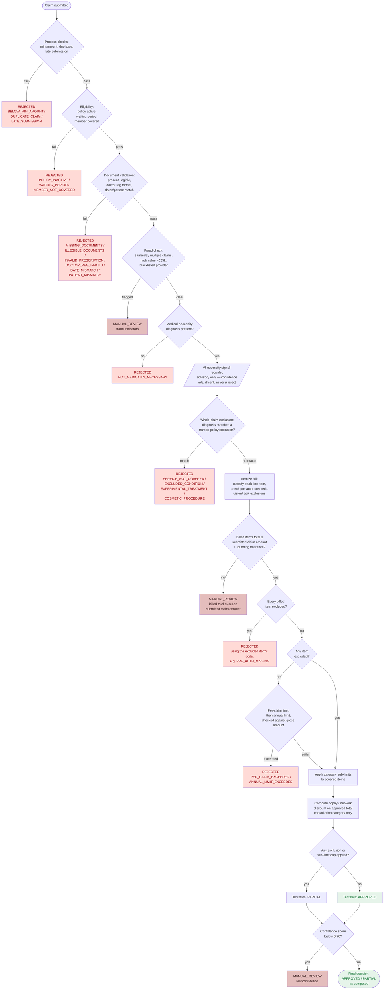

# Decision Logic

This mirrors `adjudication_rules.md`'s own step structure and matches the
actual implementation in `lib/rules-engine/engine.ts` exactly — every node
below corresponds to a named step in that file's rule trail, so any claim's
detail page shows you exactly which path it took through this diagram.

## Priority rules (from `adjudication_rules.md`, and how the engine honors them)

1. **Safety first** — fraud detection runs before coverage/limit logic and
   routes straight to `MANUAL_REVIEW`, bypassing everything downstream.
2. **Exclusions override everything** — the whole-claim exclusion check runs
   before limit checks, which is why a claim that's both excluded *and* over
   the per-claim limit (e.g. an excluded ₹8,000 weight-loss claim) is
   rejected for the exclusion, not the limit.
3. **Hard limits cannot be exceeded** — but only apply to the *gross* amount
   when nothing was excluded (see `docs/ASSUMPTIONS.md` #3 for why: two of
   the ten provided test cases exceed the per-claim limit yet are correctly
   partial/rejected for their own item-level reason instead).
4. **Medical necessity is mandatory** — the deterministic check (diagnosis
   must be present) is a hard gate; the LLM's necessity opinion is not — it
   only nudges confidence.
5. **When in doubt, refer for manual review** — the confidence-below-0.70
   gate is the final step of every path, so even a claim that clears every
   other check can still end up in `MANUAL_REVIEW` if the system isn't sure.
6. **Extracted bill amounts are never trusted over what the claimant
   submitted** — added during a security review after a live
   prompt-injection test got the LLM to report a bill amount higher than
   the submitted `claim_amount`, which the engine then paid out.
   The billed-total-vs-claim-amount check runs right after itemization,
   before any money is computed, and is itself fully deterministic — it
   doesn't try to make extraction trustworthy, it just refuses to let a
   mismatched number drive a payout.

## Scope note: what this diagram does and doesn't cover

Every limit, sub-limit, waiting period, exclusion, and copay/discount rate
this flowchart references is read from whatever policy is currently active
in `PolicyConfig` (admin-editable at `/admin/policy`), not necessarily the
static `data/policy_terms.json` on disk — the two start out identical, but
diverge the moment an admin saves an edit. The diagram's shape (which
checks run, in what order) never changes; only the threshold *values* each
node compares against can.

The **appeals workflow** is deliberately not represented as a node here. It
is a separate, post-decision process: a human administrator reviewing a
`REJECTED`/`PARTIAL` claim and choosing to uphold or overturn it. An
overturned appeal changes `Claim.status` but never re-runs or rewrites the
engine's own decision above — the diagram describes how the *original*
automated decision was reached, and that reasoning trail stays intact and
visible regardless of what an appeal later does to the claim's outward
status. See `docs/ASSUMPTIONS.md` #19-22 for the appeal-specific rules.
